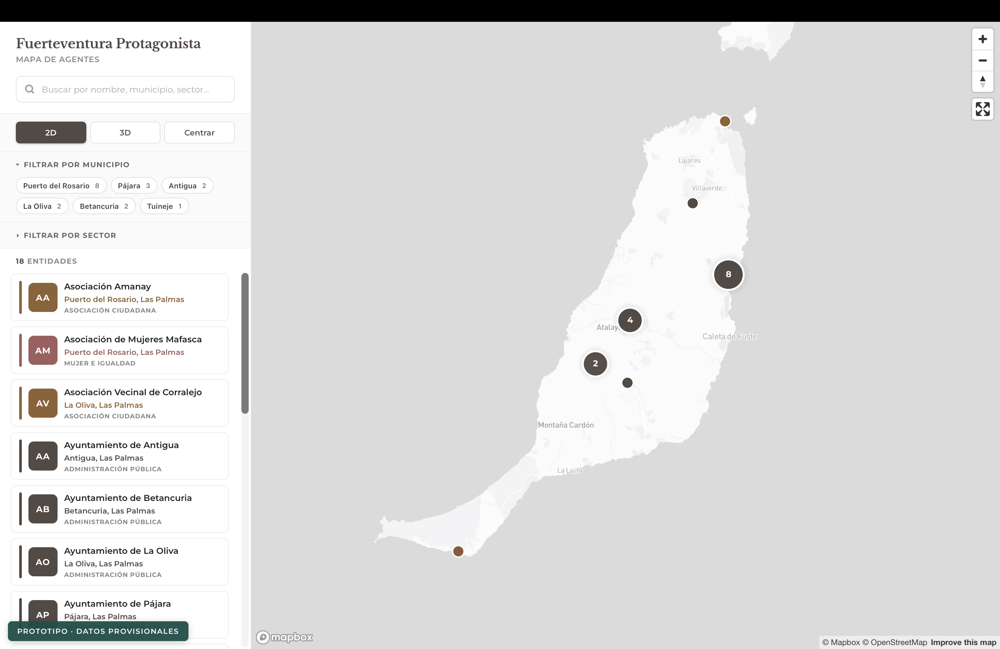

# Fuerteventura Protagonista — Mapa de agentes

Prototipo del mapa público para **Fuerteventura Protagonista** (Cabildo de Fuerteventura + Fundación General de la Universidad de La Laguna). Replica la experiencia del mapa de Canarias Convive adaptada a la identidad visual de Fuerteventura: paleta marrón/tierra, tipografía serif, datos de la isla.

🔗 **Demo en vivo:** [diegoalegil.github.io/fuerteventuraprotagonista-mapa](https://diegoalegil.github.io/fuerteventuraprotagonista-mapa/)



> ⚠️ **Datos provisionales.** Los 18 puntos cargados ahora son ayuntamientos, el Cabildo y entidades públicas conocidas a modo de placeholder. Falta importar el listado completo del back-office cuando esté disponible.

## Qué hay aquí

- **Estilo Mapbox base** (`light-v11`) provisional en producción. En local se usa un fallback raster de OpenStreetMap para que el mapa no quede en blanco si el token de Mapbox está restringido a GitHub Pages.
- **Paleta corporativa**: marrón principal `#534a44`, beige `#F5EEDA`, acentos tierra (`#A87F4E`, `#8E5A3C`, `#B47545`).
- **Tipografía**: Libre Baskerville para titulares (serif corporativo) y Montserrat para el resto.
- **Clustering automático** — los marcadores se agrupan al solapar; un clic en el cluster hace zoom.
- **Marcadores coloreados por sector** — 8 sectores provisionales (Administración pública, Asociación ciudadana, Cultura, Educación, Servicios sociales, Mayores, Mujer e igualdad, Medio ambiente).
- **Filtros combinables** por sector y por municipio. Al filtrar por municipio, la cámara vuela hasta él.
- **Vista 3D** — edificios sector-coloreados extruidos; en producción añade terreno real con DEM de Mapbox.
- **Búsqueda por substring** insensible a acentos y mayúsculas, contra nombre, municipio, provincia, dirección, sector y protagonista.
- **Panel de detalle** lateral con dirección, teléfono, email, redes sociales y botón "Cómo llegar" a Google Maps.
- **Responsive mobile** — el panel se convierte en bottom sheet expandible (tap en el handle para alternar).

## Tecnología

- HTML / CSS / JavaScript vanilla. Sin frameworks ni build tools.
- [Mapbox GL JS](https://docs.mapbox.com/mapbox-gl-js/) v3.21.
- [Turf.js](https://turfjs.org/) v7.3 para las geometrías 3D.
- Terreno en producción: `mapbox://mapbox.mapbox-terrain-dem-v1`.
- Tipografías: [Libre Baskerville](https://fonts.google.com/specimen/Libre+Baskerville) + [Montserrat](https://fonts.google.com/specimen/Montserrat).

## Estructura

```
.
├── index.html           # App completa (HTML + CSS + JS en un único archivo)
├── entities.geojson     # 18 entidades provisionales (placeholder)
├── README.md
└── LICENSE
```

## Cómo correrlo en local

```bash
python3 -m http.server 8010 --bind 127.0.0.1
```

Y abre `http://127.0.0.1:8010`.

En local, la app cambia automáticamente a un mapa base raster de OpenStreetMap para evitar los 403 del token público de Mapbox. Si quieres forzar el estilo Mapbox exacto en local, abre `http://127.0.0.1:8010/?mapbox=1` y usa un token con `127.0.0.1` permitido en el panel de Mapbox.

## Roadmap

- [ ] Importar listado real de entidades cuando esté disponible.
- [ ] Diseñar estilo custom en Mapbox Studio con la paleta de Fuerteventura Protagonista.
- [ ] Logos de las entidades (cuando estén subidos al back-office).
- [ ] Compartir un agente concreto vía URL (`?entity={id}`).
- [ ] GitHub Actions que refresca `entities.geojson` automáticamente.

## Licencia

MIT. Ver [LICENSE](LICENSE).
